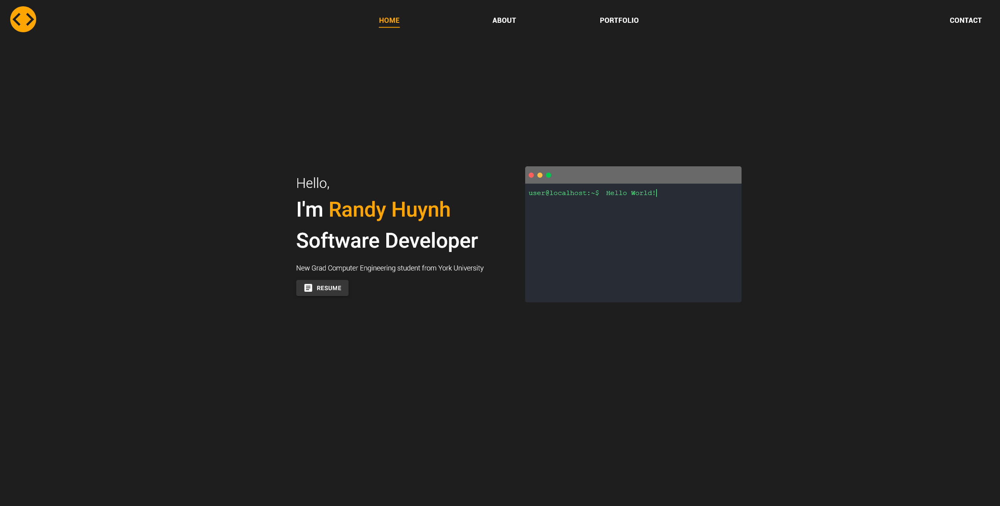

# Portfolio App

## Description


This portfolio app showcases my skills and projects as a software developer. It's designed to be a professional space where I can share my work with potential employers, clients, and the developer community. The app is built using React and Material UI and marks the beginning of my journey in software development and UI/UX design.

## Visit my site!

You can view my site here at: [https://www.randy-huynh.com/](https://www.randy-huynh.com/)

## Features

- <strong>Project Showcase</strong>: Each project is presented with details, including technologies used, my role in the project, and challenges faced.
- <strong>Responsive Design</strong>: The portfolio is fully responsive, ensuring a seamless experience across all devices.
- <strong>Contact Form</strong>: A simple and intuitive contact form for visitors to get in touch with me.
- <strong>Project Carousel</strong>: A visually engaging and interactive carousel that showcases my projects. This feature allows visitors to easily browse through my work, highlighting each project with eye-catching images and brief summaries. The carousel format is designed for user-friendly navigation, making it simple for visitors to discover and engage with my diverse range of projects.

## Installation

To install the project, follow these steps:

1. **Clone the Repository:**

   ```
   git clone https://github.com/artmedia1/portfolio.git
   ```

2. **Install Dependencies:**
   ```
   npm install
   ```
3. **Start the application::**
    ```
    npm start
    ```


